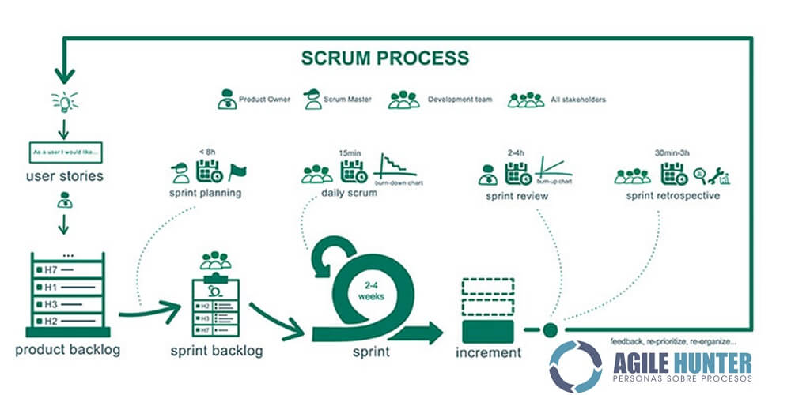

## Métrica V3
<ul>
  
  <li>
    <a href="https://manuel.cillero.es/doc/metodologia/metrica-3">Manuel Cillero</a>
  </li>
  
  <li>
    <a href="https://view.genial.ly/5db972cf855d4b0f8758bbf3/presentation-metrica-v3">Presentación Genially</a>
  </li>
  
</ul>

## RUP
<ul>

  <li>
    <a href="https://drive.google.com/file/d/1p4UK1VtFxJylQfvUU2EwOjul28jLHL7e/view">Study</a>
  </li>

  <li>
    <a href="https://drive.google.com/drive/folders/1bNkT0BjSs6NqdtLWn5JOEoGb7v5kANN-?usp=sharing">Exercises to practice</a>
  </li>

</ul>

## SCRUM
<ul>
  
  <li>
    <a href="https://drive.google.com/file/d/1lSc-glQ9CePOSxRrBwy2nBefvDxWAa9G/view">Study</a>
  </li>

  <li>
    <a href="https://drive.google.com/file/d/1K8D4CJAquqwgH00lPYvzf5rfmFFc5Wkn/view">Scrum manager</a>
  </li>

  <li>
    <a href="https://drive.google.com/file/d/197mWvpGtSO73a2Q97BQM8Y0wmR8bi0Xy/view">Kanban manual - Trello</a>
  </li>

</ul>

